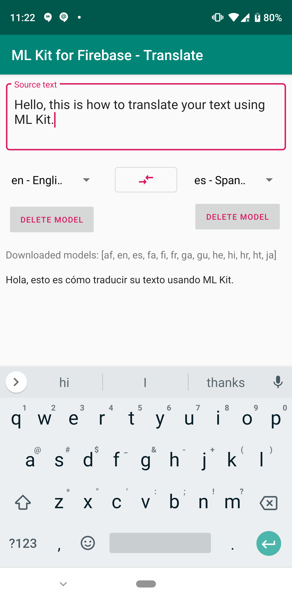

ML Kit Translate for Firebase Quickstart
==============================

The ML Kit Translate for Firebase Android Quickstart app demonstrates how to
use the Translate feature of ML Kit to perform translations of text in
your application.

Introduction
------------

- [Read more about ML Kit Translate for Firebase](https://firebase.google.com/docs/ml-kit/android/translate-text)

Getting Started
---------------

- [Add Firebase to your Android Project](https://firebase.google.com/docs/android/setup).
- Run the sample on an Android device.
- Choose the Java or Kotlin version on the initial screen.
- Type input text and press the buttons to identify languages.

Result
-----------

Support
-------

- [Stack Overflow](https://stackoverflow.com/questions/tagged/firebase-mlkit)
- [Firebase Support](https://firebase.google.com/support/).

